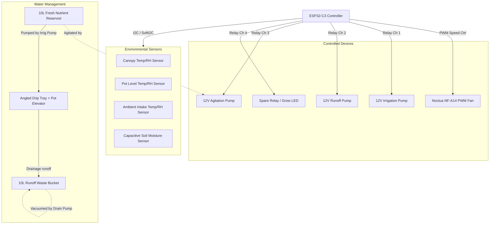

# Grow Wardrobe Automation Specification

This document serves as a living project specification and reference guide for the **Grow Wardrobe Automation System** powered by an **ESP32-C3** running MicroPython.

---

## 📌 System Overview

The system automates ventilation, environmental monitoring, irrigation, and runoff drainage for a plant grown in coco coir. It integrates telemetry with Home Assistant for real-time monitoring and alert notifications.

---

## 🛠️ Hardware Component Inventory

| Component | Quantity | Description / Specifications | Role / Function |
| :--- | :--- | :--- | :--- |
| **ESP32-C3 Board** | 1 | MicroPython-compatible MCU with WiFi | System controller and telemetry host |
| **Temp/Humidity Sensors** | 3 | AHT20 | Measures Canopy, Pot, and Ambient intake air |
| **Soil Moisture Sensor** | 1 | Capacitive Soil Moisture Sensor (HW-390) | Soil moisture monitoring & dry-out safety check |
| **Ventilation Fan** | 1 | Noctua NF-A14 iPPC-3000 PWM (12V) | Variable extraction fan for heat/humidity control |
| **Irrigation Pump** | 1 | 12V DC submersible water pump | Delivers nutrient solution to drip ring |
| **Agitation Pump** | 1 | 12V DC submersible water pump (low power) | Runs on schedule via Relay Channel 3 |
| **Runoff Diaphragm Pump**| 1 | 12V DC mini diaphragm vacuum pump | Empties runoff water from drip tray into waste bucket |
| **Relay Module** | 1 | 4-Channel opto-isolated relay module (5V coils) | Switches 12V power to irrigation, runoff, and agitation pumps (1 spare channel) |
| **Buckets** | 2 | 10L opaque plastic buckets with lids | 1x Fresh Nutrient Reservoir, 1x Runoff Waste Bucket |
| **Drip Tray & Elevator** | 1 | Angled drain tray + plastic pot elevator | Allows runoff to drain away from fabric pot base |
| **Power Supply Unit** | 1 | 12V DC Power Supply (min 3A to 5A capacity) | System power source (pumps, fan, MCU) |
| **Buck Converter** | 1 | LM2596 or similar step-down converter | Steps 12V down to 5V to power ESP32-C3 |
| **Flyback Diodes** | 3 | 1N4007 or similar standard diodes | Absorbs inductive voltage spikes from pumps (recommended even with relays) |

---

## 🔌 System Wiring & Pin Allocation

To run all items from a single **12V power supply**, the power distribution and GPIO configuration are designed as follows:

### Power Distribution
*   **12V DC Rail**: Powers the Noctua Fan and the common ports (`COM`) of Relay Channels 1, 2, and 3.
*   **5V DC Rail**: Output from Buck Converter. Connects to ESP32-C3 **5V/VIN** and the Relay Board **JD-VCC** (with jumper removed to power the relay coils).
*   **3.3V DC Rail**: Supplied by the ESP32-C3 onboard regulator. Powers the sensors and the Relay Board **VCC** (for logic-side optocoupler).
*   **Common Ground**: All ground connections (12V GND, 5V GND, ESP32 GND) **must be tied together**.

### GPIO Pin Mapping (Proposed)

| ESP32-C3 Pin | Interface Type | Connected Device | Purpose |
| :--- | :--- | :--- | :--- |
| **GPIO 0** | Analog (ADC1_CH0) | HW-390 Soil Moisture Sensor | Telemetry & Dry Failsafe check |
| **GPIO 1** | Digital Out (PWM) | Noctua Fan Speed Pin | Fan speed control (25 kHz PWM) |
| **GPIO 2** | Digital Out | Relay Channel 1 IN (Irrigation) | Switches 12V irrigation pump |
| **GPIO 3** | Digital Out | Relay Channel 2 IN (Runoff) | Switches 12V runoff vacuum pump |
| **GPIO 4** | Digital Out | Relay Channel 3 IN (Agitation) | Switches 12V agitation pump |
| **GPIO 20**| Digital Out | Relay Channel 4 IN (Spare/LED) | Switches grow light or general spare channel |
| **GPIO 5** | I2C SDA (SoftI2C 1)| Canopy Temp/Humidity Sensor | Canopy environment readings |
| **GPIO 6** | I2C SCL (SoftI2C 1)| Canopy Temp/Humidity Sensor | Canopy environment readings |
| **GPIO 7** | I2C SDA (SoftI2C 2)| Pot-Level Temp/Humidity Sensor| Lower canopy environment readings |
| **GPIO 8** | I2C SCL (SoftI2C 2)| Pot-Level Temp/Humidity Sensor| Lower canopy environment readings |
| **GPIO 9** | I2C SDA (SoftI2C 3)| Ambient Intake Temp/Sensor | Outer intake environment readings |
| **GPIO 10**| I2C SCL (SoftI2C 3)| Ambient Intake Temp/Sensor | Outer intake environment readings |

> [!NOTE]
> Since AHT20 sensors have a fixed I2C address (`0x38`), we connect them to separate GPIOs and use MicroPython's `machine.SoftI2C` to establish three independent buses.

---

## 📐 System Logic & Control Algorithms

### 1. Ventilation Control (Noctua PWM Fan)
The fan speed is modulated using a 25 kHz PWM signal. The duty cycle is dynamically updated based on the 3 temperature/humidity readings:
*   **Canopy Sensor**: Primary feedback loop. Keeps canopy temperatures in the optimal range (e.g., 22°C - 26°C) and relative humidity controlled.
*   **Pot Sensor**: Secondary feedback loop. Detects microclimates at the soil/pot surface. Large deviations between pot and canopy temperatures indicate poor airflow.
*   **Ambient Intake Sensor**: Feedforward input. If the room housing the wardrobe is hot/humid, raising fan speed may be counterproductive. The controller uses the ambient readings to determine the theoretical minimum temperature/humidity achievable by venting and adjusts accordingly.
*   *Algorithm*: (TBD) Will likely be a proportional-integral (PI) control loop or a lookup table evaluating the differential: $\Delta T = T_{\text{Canopy}} - T_{\text{Ambient}}$.

### 2. LED Light Schedule (Optional)
*   **Control**: Relay switched on a strict time duration (e.g., 18/6 light cycle for vegetative stage, 12/12 for flowering).
*   **Status**: Low priority. The ESP32-C3 can manage this via an internal real-time clock (syncing time via NTP on boot) or a home automation script, but a mechanical/smart plug timer can serve as a physical backup.

### 3. Irrigation System (Fresh Reservoir)
*   **Agitation Pump**: Runs on a scheduled timer (e.g., 2 minutes every hour, or for 5 minutes immediately prior to an irrigation event) to prevent concentrated liquid nutrients from settling out of suspension while avoiding heating the water.
*   **Irrigation Pump**: Runs on a strict interval timer.
    *   *Default Schedule*: 15 seconds every 4 hours (adjustable based on plant size).
    *   *Volume Target*: Calculated to supply enough water to saturate the coco coir and yield a ~10-20% runoff volume.
*   **Soil Moisture Sensor (HW-390)**:
    *   Acts as a **telemetry monitor and failsafe**.
    *   *Safety Failsafe*: If soil moisture dips below a critical threshold (e.g., <15% for coco coir) and stays dry for more than 30 minutes, the system publishes a high-priority warning to Home Assistant. Optionally, it can trigger an emergency short watering cycle or lock out further watering if a pump failure is suspected.

### 4. Runoff Drainage System (Waste Bucket)
*   **Drip Tray & Elevator**: The fabric pot is suspended above the drip tray on a plastic elevator, preventing the root zone from sitting in stagnant, salty runoff water.
*   **Runoff Diaphragm Pump**: Positioned to draw water from the lowest point of the angled drip tray.
*   **Schedule & Offset**:
    *   Draining must occur after watering.
    *   *Offset Delay*: Runs **10 minutes after** the irrigation pump completes, allowing water to fully saturate the coco coir and drain out of the bottom of the pot.
    *   *Duration*: Runs for a fixed duration (e.g., 60 seconds) to ensure the line is sucked dry and the drip tray is clear.

---

## ⚠️ Safety, Failsafes & Reliability Controls

To prevent water damage, pump burn-outs, or crop loss, the following failsafes are integrated into the design:

1.  **Inductive Kickback & Contact Protection**: Although the opto-isolated relay board protects the ESP32's digital pins from high-voltage spikes, turning off inductive pump motors still causes arcing (sparks) across the relay's mechanical contacts. Soldering a **flyback diode (1N4007)** in parallel across each pump's motor terminals is still highly recommended to prevent arcing (which degrades and pits the relay contacts over time) and to suppress high-frequency electromagnetic interference (EMI) that can cause the ESP32 to freeze.
2.  **Dry-Run Pump Protection**: Submersible and diaphragm pumps can burn out if run dry for extended periods. The firmware enforces maximum run times (e.g., irrigation pump cannot run for >45 seconds continuously; runoff pump cannot run for >3 minutes continuously).
3.  **Runoff Waste Bucket Level Switch (Crucial Addition)**: If the waste bucket fills up, runoff water will overflow onto the floor. Installing a simple **float switch** in the lid of the 10L waste bucket wired to an ESP32 GPIO allows the controller to immediately disable irrigation and sound an alarm if the bucket is full.
4.  **Hardware Watchdog Timer (WDT)**: ESP32-C3 firmware may lock up due to WiFi drops or electrical noise. Enabling a hardware watchdog timer in MicroPython (`machine.WDT`) ensures that if the system hangs, it will automatically reboot within 10-15 seconds rather than leaving a pump stuck in the "ON" state.
