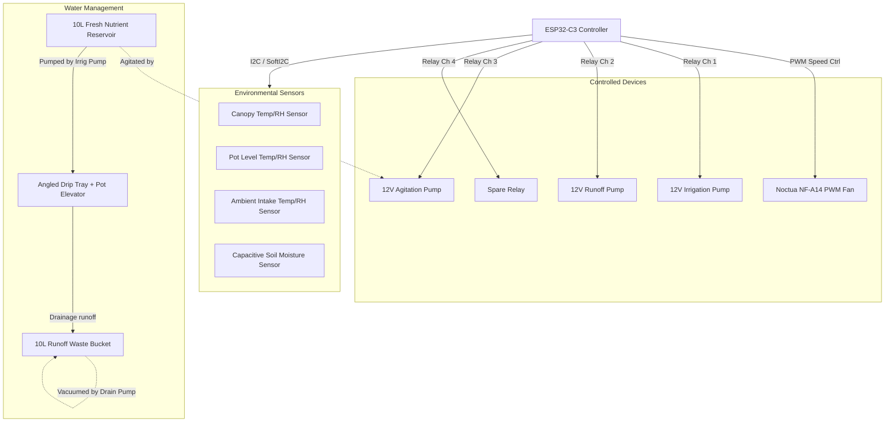

# Grow Wardrobe Automation Specification

This document serves as a living project specification and reference guide for the **Grow Wardrobe Automation System** powered by an **ESP32-C3** running MicroPython.

---

## 📌 System Overview

The system automates ventilation, environmental monitoring, irrigation, and runoff drainage for a plant grown in coco coir. It integrates telemetry with Home Assistant for real-time monitoring and alert notifications.


```mermaid
graph TD
    %% Controller
    ESP32[ESP32-C3 Controller]

    %% Sensors
    subgraph Sensors [Environmental Sensors]
        T_Canopy[Canopy Temp/RH Sensor]
        T_Pot[Pot Level Temp/RH Sensor]
        T_Ambient[Ambient Intake Temp/RH Sensor]
        Moisture[Capacitive Soil Moisture Sensor]
    end

    %% Actuators & Loads
    subgraph Actuators [Controlled Devices]
        Fan[Noctua NF-A14 PWM Fan]
        Pump_Irrig[12V Irrigation Pump]
        Pump_Drain[12V Runoff Pump]
        Pump_Agit[12V Agitation Pump]
        Relay_Spare[Spare Relay]
    end

    %% Water Buckets
    subgraph Reservoirs [Water Management]
        Res[10L Fresh Nutrient Reservoir]
        Waste[10L Runoff Waste Bucket]
        DripTray[Angled Drip Tray + Pot Elevator]
    end

    %% Connections
    ESP32 -->|I2C / SoftI2C| Sensors
    ESP32 -->|PWM Speed Ctrl| Fan
    ESP32 -->|Relay Ch 1| Pump_Irrig
    ESP32 -->|Relay Ch 2| Pump_Drain
    ESP32 -->|Relay Ch 3| Pump_Agit
    ESP32 -->|Relay Ch 4| Relay_Spare
    
    %% Water Flow
    Res -.->|Agitated by| Pump_Agit
    Res -->|Pumped by Irrig Pump| DripTray
    DripTray -->|Drainage runoff| Waste
    Waste -.->|Vacuumed by Drain Pump| Waste
```

---

## 🛠️ Hardware Component Inventory

| Component | Quantity | Description / Specifications | Role / Function |
| :--- | :--- | :--- | :--- |
| **ESP32-C3 Board** | 1 | MicroPython-compatible MCU with WiFi | System controller and telemetry host |
| **Temp/Humidity Sensors** | 3 | AHT20 | Measures Canopy, Pot, and Ambient intake air |
| **Soil Moisture Sensor** | 1 | Capacitive Soil Moisture Sensor (HW-390) | Soil moisture monitoring & dry-out safety check |
| **Ventilation Fan** | 1 | Noctua NF-A14 iPPC-3000 PWM (12V) | Variable extraction fan for heat/humidity control |
| **Irrigation Pump** | 1 | 12V DC submersible water pump | Delivers nutrient solution to drip ring |
| **Agitation Pump** | 1 | 12V DC submersible water pump (low power) | Runs on schedule via Relay Channel 3 |
| **Runoff Diaphragm Pump**| 1 | 12V DC mini diaphragm vacuum pump | Empties runoff water from drip tray into waste bucket |
| **Relay Module** | 1 | 4-Channel opto-isolated relay module (5V coils) | Switches 12V power to irrigation, runoff, and agitation pumps (1 spare channel) |
| **Buckets** | 2 | 10L opaque plastic buckets with lids | 1x Fresh Nutrient Reservoir, 1x Runoff Waste Bucket |
| **Drip Tray & Elevator** | 1 | Angled drain tray + plastic pot elevator | Allows runoff to drain away from fabric pot base |
| **Power Supply Unit** | 1 | 12V DC Power Supply (min 3A to 5A capacity) | System power source (pumps, fan, MCU) |
| **Buck Converter** | 1 | LM2596 or similar step-down converter | Steps 12V down to 5V to power ESP32-C3 |
| **Flyback Diodes** | 3 | 1N4007 or similar standard diodes | Absorbs inductive voltage spikes from pumps (recommended even with relays) |

---

## 🔌 System Wiring & Pin Allocation

To run all items from a single **12V power supply**, the power distribution and GPIO configuration are designed as follows:

### Power Distribution
*   **12V DC Rail**: Powers the Noctua Fan and the common ports (`COM`) of Relay Channels 1, 2, and 3.
*   **5V DC Rail**: Output from Buck Converter. Connects to ESP32-C3 **5V/VIN** and the Relay Board **JD-VCC** (with jumper removed to power the relay coils).
*   **3.3V DC Rail**: Supplied by the ESP32-C3 onboard regulator. Powers the sensors and the Relay Board **VCC** (for logic-side optocoupler).
*   **Common Ground**: All ground connections (12V GND, 5V GND, ESP32 GND) **must be tied together**.

### GPIO Pin Mapping (Proposed)

| ESP32-C3 Pin | Interface Type | Connected Device | Purpose |
| :--- | :--- | :--- | :--- |
| **GPIO 0** | Analog (ADC1_CH0) | HW-390 Soil Moisture Sensor | Telemetry & Dry Failsafe check |
| **GPIO 1** | Digital Out (PWM) | Noctua Fan Speed Pin | Fan speed control (25 kHz PWM) |
| **GPIO 2** | Digital Out | Relay Channel 1 IN (Irrigation) | Switches 12V irrigation pump |
| **GPIO 3** | Digital Out | Relay Channel 2 IN (Runoff) | Switches 12V runoff vacuum pump |
| **GPIO 4** | Digital Out | Relay Channel 3 IN (Agitation) | Switches 12V agitation pump |
| **GPIO 20**| Digital Out | Relay Channel 4 IN (Spare) | General spare relay channel |
| **GPIO 5** | I2C SDA (SoftI2C 1)| Canopy Temp/Humidity Sensor | Canopy environment readings |
| **GPIO 6** | I2C SCL (SoftI2C 1)| Canopy Temp/Humidity Sensor | Canopy environment readings |
| **GPIO 7** | I2C SDA (SoftI2C 2)| Pot-Level Temp/Humidity Sensor| Lower canopy environment readings |
| **GPIO 8** | I2C SCL (SoftI2C 2)| Pot-Level Temp/Humidity Sensor| Lower canopy environment readings |
| **GPIO 9** | I2C SDA (SoftI2C 3)| Ambient Intake Temp/Sensor | Outer intake environment readings |
| **GPIO 10**| I2C SCL (SoftI2C 3)| Ambient Intake Temp/Sensor | Outer intake environment readings |

> [!NOTE]
> Since AHT20 sensors have a fixed I2C address (`0x38`), we connect them to separate GPIOs and use MicroPython's `machine.SoftI2C` to establish three independent buses.


---

## 📐 System Logic & Control Algorithms

### 1. Ventilation Control (Noctua PWM Fan)
The extraction fan speed is modulated using a 25 kHz PWM signal from the ESP32-C3 (`lib/drivers/fan.py`).
- **Operating Modes**: Strictly `AUTO` and `MANUAL` (no `DRY` mode).
- **AUTO Mode (VPD PI Controller)**:
  - Driven by the closed-loop controller in [`lib/controllers/vpd.py`](../../lib/controllers/vpd.py).
  - Calculates real-time leaf Vapor Pressure Deficit (VPD) from the Canopy AHT20 sensor.
  - Dynamically modulates fan duty cycle using proportional and integral terms to hold canopy VPD at target (default: 1.1 kPa).
  - **Ambient Differentials**: Evaluates $\Delta T = T_{\text{Canopy}} - T_{\text{Ambient}}$ and $\Delta RH$. If ambient air is unfavorable (too hot or saturated), venting is throttled to prevent worsening canopy climate.
- **MANUAL Mode**: Direct fan speed control from 10% to 100% via MQTT or the dashboard slider.

### 2. Grow Light Schedule & Photoperiod Tracking
- **Physical Switching**: Controlled via an external smart plug (e.g. Zigbee/Shelly) in Home Assistant to ensure 240V AC mains isolation from low-voltage DC electronics.
- **Photoperiod Configuration**:
  - Presets: `18/6` (Vegetative), `12/12` (Flowering), `24/0` (Continuous).
  - Start Time: Configurable light start time (e.g. `06:00`), persisted in the ESP32 flash (`config_store.json`).
  - The dashboard displays a 24-hour photoperiod timeline graphic with live transition countdowns.

### 3. Dual-Medium Irrigation System
Powered by [`lib/controllers/irrigation.py`](../../lib/controllers/irrigation.py):
- **Coco Coir Strategy (High-Frequency Fertigation)**:
  - Runs on a timed interval (default: every 4 hours, configurable 1–24h).
  - 4-Phase Automated Sequence:
    1. **Agitate** (5 mins): Runs Relay Ch 3 to aerate and mix nutrient solution.
    2. **Drip Feed** (configurable, e.g. 25 secs): Runs Relay Ch 1 to deliver fresh solution to drip ring.
    3. **Drain Wait** (10 mins): Pauses pumps to let water saturate coco and collect in drip tray.
    4. **Runoff Drain** (60 secs): Runs Relay Ch 2 diaphragm pump to vacuum runoff into waste bucket.
- **Organic Soil Strategy (Closed-Loop Demand)**:
  - Continuously monitors capacitive soil moisture (HW-390).
  - **Water Trigger Threshold**: Starts watering when soil drops to or below threshold (e.g. 28%).
  - **Target Moisture Level**: Goal moisture level (e.g. 45%).
  - **Soak Cooldown**: Enforces a mandatory delay (e.g. 60 mins) after watering to let water disperse through root zone before re-evaluating.
  - **Safety Max Water Cutoff**: Hardware safety timeout (e.g. 60 secs) prevents runaway watering if sensor disconnects.

---

## 📡 MQTT Integration & Home Assistant

The ESP32-C3 connects to Mosquitto MQTT under the base topic `wardrobe/` (Client ID: `esp32_growdrobe`).

### Retain Conventions
- **State topics (`.../state`) MUST have `retain=True`**: Ensures reconnecting clients and Home Assistant immediately receive current states.
- **Command topics (`.../set`, `.../trigger`) MUST have `retain=False`**: Prevents stale commands from being replayed on reboot.

### Key MQTT Topics
| Topic | Type | Payload / Values |
| :--- | :--- | :--- |
| `wardrobe/ventilation/mode/state` / `.../set` | State / Command | `AUTO`, `MANUAL` |
| `wardrobe/ventilation/fan/state` / `.../set` | State / Command | `10` – `100` |
| `wardrobe/irrigation/mode/state` / `.../set` | State / Command | `AUTO`, `MANUAL` |
| `wardrobe/irrigation/state` / `.../trigger` | State / Command | `IDLE`, `AGITATE`, `WATER`, `DRAIN`, `EMERGENCY_STOP` |
| `wardrobe/config/grow_medium/state` / `.../set` | State / Command | `coco`, `soil` |
| `wardrobe/config/light_preset/state` / `.../set` | State / Command | `18/6`, `12/12`, `24/0` |
| `wardrobe/config/light_start_time/state` / `.../set` | State / Command | `HH:MM` (e.g. `06:00`) |

---

## 🚀 Flashing & Deployment

### 1. Remote WebREPL Deployment (Over WiFi)
To flash without a USB cable (uses configured `DEVICE_IP` in `devices/grow_wardrobe/config.py`):
```bash
python3 scripts/deploy.py grow_wardrobe --remote
```
The deployer syncs all shared libraries to `/lib`, syncs device files to `/`, and soft-resets the MCU.

### 2. Local USB Deployment
With the ESP32 connected via USB:
```bash
python3 scripts/deploy.py grow_wardrobe
```

---

## ⚠️ Safety, Failsafes & Reliability Controls

1. **Inductive Kickback & Contact Protection**: Opto-isolated relays protect GPIOs. Flyback diodes across 12V pump terminals suppress inductive spikes and EMI.
2. **Dry-Run & Runaway Pump Protection**: Strict maximum run times enforced in firmware (e.g. max 60–120s for drip pump).
3. **Hardware Watchdog Timer (WDT)**: If the MicroPython loop locks up, the hardware watchdog reboots the MCU within 10–15 seconds, ensuring no relay is left energized.

---

## 🖥️ Companion Devices & Dashboards

1. **[Grow Wardrobe Web Dashboard](../../frontend/grow_wardrobe/README.md)**: Modern React/Tailwind web app deployed directly to Home Assistant Lovelace for real-time telemetry, fan dynamics, irrigation scheduling, and photoperiod visualization.
2. **[Wardrobe Touchscreen Control Panel](../wardrobe_touchscreen/README.md)**: Dedicated 2.8" SPI touchscreen powered by ESP32-C3 Super Mini running ESPHome.
3. **[Wardrobe Camera Node](../wardrobe_camera/README.md)**: ESP32-CAM module streaming live JPEG video and driving automated growth timelapse captures.
