# Grow Wardrobe Wiring Specification

This document details the physical electrical wiring layout for the **Grow Wardrobe Automation System** using the **ESP32-C3** controller.

---

## 🔌 System Schematic Map (Mermaid)

Below is the complete system wiring schema. This includes power distribution, three independent SoftI2C environmental sensor buses, relay routing, and inductive kickback protection (flyback diodes).

```mermaid
graph TD
    %% Styling
    classDef psu fill:#ff9999,stroke:#333,stroke-width:2px;
    classDef logic fill:#99ccff,stroke:#333,stroke-width:1px;
    classDef sensor fill:#ccffcc,stroke:#333,stroke-width:1px;
    classDef actuator fill:#ffff99,stroke:#333,stroke-width:1px;
    classDef ground fill:#cccccc,stroke:#333,stroke-width:1px;

    %% Power Sources
    subgraph PSU ["Power Supply & Regulation"]
        PSU_12V["12V DC Adapter"]
        Buck["LM2596 Buck Converter"]
    end

    %% Controller
    subgraph MCU ["ESP32-C3 Controller"]
        VIN["5V / VIN"]
        V33["3.3V Out"]
        GND["GND"]
        G0["GPIO 0 (ADC1)"]
        G2["GPIO 2"]
        G3["GPIO 3"]
        G4["GPIO 4"]
        G5["GPIO 5 (SDA1)"]
        G6["GPIO 6 (SCL1)"]
        G7["GPIO 7 (SDA2)"]
        G8["GPIO 8 (SCL2)"]
        G9["GPIO 9 (SDA3)"]
        G10["GPIO 10 (SCL3)"]
        G12["GPIO 12 (PWM)"]
        G13["GPIO 13"]
    end

    %% Sensors
    subgraph Sensors ["I2C & Analog Sensors"]
        Canopy["Canopy AHT20 Sensor"]
        Pot["Pot AHT20 Sensor"]
        Ambient["Ambient AHT20 Sensor"]
        Moisture["Soil Moisture Sensor"]
    end

    %% Actuators & Relays
    subgraph Switch ["4-Channel Relay Module"]
        R_VCC["VCC Logic"]
        R_GND["GND Logic"]
        JD_VCC["JD-VCC Coil Power"]
        IN1["IN 1"]
        IN2["IN 2"]
        IN3["IN 3"]
        IN4["IN 4"]
    end

    subgraph Actuators ["12V Actuators"]
        Fan["Noctua PWM Fan"]
        Pump1["Irrigation Pump"]
        Pump2["Runoff Pump"]
        Pump3["Agitation Pump"]
        Light["Grow LED / Spare"]
    end

    %% Flyback Diodes
    subgraph Diodes ["Flyback Protection"]
        D1["1N4007 Diode"]
        D2["1N4007 Diode"]
        D3["1N4007 Diode"]
    end

    %% Power Wiring
    PSU_12V -->|12V| Buck
    PSU_12V -->|12V| Fan
    PSU_12V -->|12V to Relays| Switch
    Buck -->|5V| VIN
    Buck -->|5V| JD_VCC
    V33 -->|3.3V| Canopy
    V33 -->|3.3V| Pot
    V33 -->|3.3V| Ambient
    V33 -->|3.3V| Moisture
    V33 -->|3.3V| R_VCC

    %% Ground Connections
    PSU_12V ---|GND| GND
    Buck ---|GND| GND
    GND --- Canopy
    GND --- Pot
    GND --- Ambient
    GND --- Moisture
    GND --- R_GND
    GND --- Fan

    %% I2C Bus Wiring
    G5 -->|SDA1| Canopy
    G6 -->|SCL1| Canopy
    G7 -->|SDA2| Pot
    G8 -->|SCL2| Pot
    G9 -->|SDA3| Ambient
    G10 -->|SCL3| Ambient

    %% Analog Sensor
    G0 -->|ADC| Moisture

    %% Actuator Controls
    G12 -->|PWM Speed| Fan
    G2 -->|Ctrl 1| IN1
    G3 -->|Ctrl 2| IN2
    G4 -->|Ctrl 3| IN3
    G13 -->|Ctrl 4| IN4

    %% Relays to Loads
    IN1 -.-> Pump1
    IN2 -.-> Pump2
    IN3 -.-> Pump3
    IN4 -.-> Light

    %% Diode placement
    Pump1 --- D1
    Pump2 --- D2
    Pump3 --- D3

    class PSU_12V,Buck,VIN,V33,R_VCC,JD_VCC psu;
    class Canopy,Pot,Ambient,Moisture sensor;
    class Fan,Pump1,Pump2,Pump3,Light actuator;
    class D1,D2,D3 logic;
    class GND,R_GND ground;
```

---

## 📋 Pinout Reference Table

| Pin | Interface | Component | Function |
| :--- | :--- | :--- | :--- |
| **VIN (5V)** | Power Input | LM2596 Output (5V) | Main board power input |
| **3.3V Out** | Power Output | Sensor Power Rail / Relay VCC | Powers logical circuits of sensors and optocouplers |
| **GND** | Ground | Common Ground | Unified ground for all modules |
| **GPIO 0** | ADC (Analog) | HW-390 Soil Moisture Sensor | Soil hydration telemetry |
| **GPIO 2** | Digital Output | Relay Channel 1 IN | Switches 12V Irrigation Pump |
| **GPIO 3** | Digital Output | Relay Channel 2 IN | Switches 12V Runoff Pump |
| **GPIO 4** | Digital Output | Relay Channel 3 IN | Switches 12V Agitation Pump |
| **GPIO 13** | Digital Output | Relay Channel 4 IN | Switches 12V Grow Light (or Spare) |
| **GPIO 12** | PWM Output | Noctua PWM Fan Speed pin | Controls variable speed ventilation |
| **GPIO 5** | SoftI2C SDA 1 | Canopy AHT20 SDA | Temperature/Humidity (Canopy) |
| **GPIO 6** | SoftI2C SCL 1 | Canopy AHT20 SCL | Temperature/Humidity (Canopy) |
| **GPIO 7** | SoftI2C SDA 2 | Pot AHT20 SDA | Temperature/Humidity (Soil Level) |
| **GPIO 8** | SoftI2C SCL 2 | Pot AHT20 SCL | Temperature/Humidity (Soil Level) |
| **GPIO 9** | SoftI2C SDA 3 | Ambient AHT20 SDA | Temperature/Humidity (Room Intake) |
| **GPIO 10** | SoftI2C SCL 3 | Ambient AHT20 SCL | Temperature/Humidity (Room Intake) |
